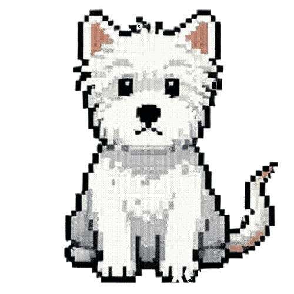

# 🐶 Desktop Pet · doei

一个陪你专注与休息的桌面小狗  
*A lightweight desktop pet for focus, breaks, and gentle motivation.*


---

## 📌 项目简介 | Introduction

**Desktop Pet · doei** 是一个基于 **Python + PySide6** 开发的桌面宠物应用。  
它会常驻在桌面最上层，通过动画、气泡提示和交互行为，陪伴你学习、写作或工作。

它不是一个“吵闹的桌宠”，而是一个 **低打扰、可关闭、可控制的陪伴工具**。

---

**Desktop Pet · doei** is a desktop companion built with **Python and PySide6**.  
It stays on top of your screen and gently supports your focus and rest through animations, speech bubbles, and interactive behaviors.

Designed to be **calm, helpful, and unobtrusive**.

---

## ✨ 功能特性 | Features

### 🐾 基础状态 | Basic States

- 🧍 **Sit（专注）**：默认状态，安静陪伴  
- 🛌 **Lay Down（休息）**：休息 / 番茄钟休息阶段  
- 🚶 **Walk（散步）**：沿屏幕边缘自动来回走动  

---

### 🍅 番茄钟 | Pomodoro Timer

- 默认 **25 分钟专注 + 5 分钟休息**
- 气泡中实时显示倒计时
- 可手动切换「专注 / 休息」
- 番茄钟运行期间不会触发自动散步，避免干扰

---

### 💤 休息提醒 | Rest Reminder

- 可开启 / 关闭
- 默认每 **50 分钟**提醒一次
- 支持 **Snooze（延迟 10 分钟）**
- 提醒时自动切换为「躺下」动画

---

### 🚶 自动散步 | Auto Walk Roundtrip

- 每 **30 分钟**自动触发一次
- 小狗会：
  - 走到屏幕一侧
  - 转身
  - 再走到另一侧
  - 停下并恢复专注状态
- 可在托盘菜单中关闭

---

### 💬 随机鼓励 | Random Chatter

- 随机弹出轻量鼓励语
- 适合写论文 / Coding / 学习场景
- 可随时关闭

---

### 🖱 交互操作 | Interaction

- **左键拖动**：移动桌宠（支持吸附屏幕边缘）
- **滚轮缩放**：调整大小（0.3× – 2.0×）
- **左键单击**：弹出鼓励语
- **左键双击**：切换「专注 / 休息」
- **右键菜单**：打开功能菜单
- **锁定模式**：防止误拖动

---

## 🧰 技术栈 | Tech Stack

- Python 3.9+
- PySide6 (Qt for Python)
- QMovie（GIF 动画）
- QSystemTrayIcon（系统托盘）
- QSettings（配置持久化）

---

## 📂 项目结构 | Project Structure

```text
desktop-pet-doei/
├─ desktop_pet_doei.py
├─ assets/
│  ├─ dog_sit_tr.gif
│  ├─ dog_laydown_tr.gif
│  ├─ dog_walkingleft_tr.gif
│  ├─ dog_walkingright_tr.gif
│  └─ tray.ico
├─ README.md
```

> ⚠️ `assets/` 目录必须存在，否则程序将无法运行。

---

## ▶️ 运行方式 | How to Run

### 1️⃣ 安装依赖 | Install dependencies

```bash
pip install PySide6
```

### 2️⃣ 运行程序 | Run

```bash
python desktop_pet_doei.py
```

---

## 📦 打包说明（可选） | Packaging (Optional)

支持使用 **PyInstaller** 打包为单文件应用（Windows）：

```bash
pip install pyinstaller
pyinstaller -w -F desktop_pet_doei.py
```

代码中已兼容 `sys._MEIPASS`，支持 one-file 模式加载资源。

---

## 🖥 平台支持 | Platform

- ✅ Windows（已测试）
- ⚠️ macOS / Linux（理论支持，未全面测试）

---

## 🐕 关于 doei | About doei

**doei** 是一只不吵闹、不打扰、但会在你需要时提醒你的桌面小狗。  
它更像一个 **陪伴式效率工具**，而不是玩具。

> *“Write one sentence. That’s progress.”*

---

## 📄 License

MIT License  
Free to use, modify, and share.
